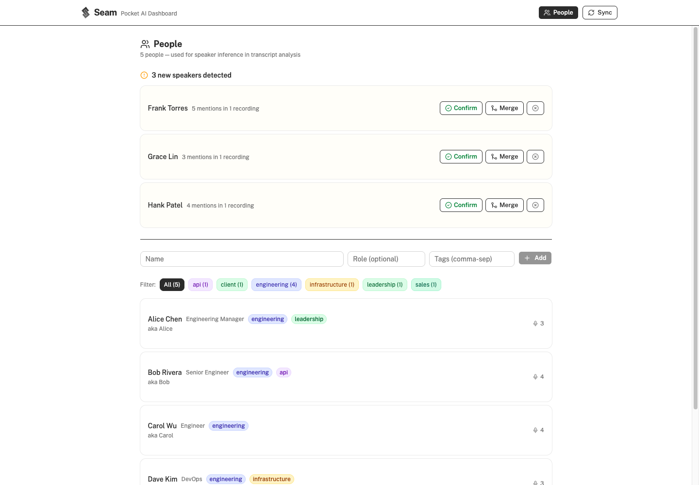

<p align="center">
  
</p>

<h1 align="center">Seam</h1>

<p align="center">
  Open-source companion for <a href="https://heypocketai.com">Pocket AI</a>.<br/>
  Pull your recordings via the API, analyze them with Claude, and browse everything in a local dashboard — no Pro subscription needed.
</p>

<p align="center">
  <a href="https://yoaquim.github.io/seam/">Website</a> · <a href="https://github.com/yoaquim/seam">GitHub</a>
</p>

## Screenshots

| Home                               | Summary                                         | Actions                                         |
| ---------------------------------- | ----------------------------------------------- | ----------------------------------------------- |
|  |  |  |

| Transcript                                            | Mind Map                                         |
| ----------------------------------------------------- | ------------------------------------------------ |
|  |  |

| People                                 |
| -------------------------------------- |
|  |

## Features

- **Automatic sync** — pulls recordings from the Pocket API with real-time log streaming
- **AI analysis** — Claude analyzes each recording: summaries, action items, decisions, open questions, key quotes, topic breakdown, mind maps, and sentiment
- **Parallel analysis** — up to 5 concurrent Claude sessions for fast bulk processing
- **Speaker inference** — Claude maps "Unknown" speakers to known people using names, roles, and context
- **Interactive mind maps** — visual topic graphs with color-coded nodes (React Flow)
- **People management** — create people with aliases, tags, roles, and notes for speaker attribution
- **People staging** — inferred speakers from analysis land in a review queue: confirm as new person, merge as alias into existing, or dismiss
- **Colored tags** — auto-assigned color palette for people and recording tags
- **Speaker assignment** — manually rename speakers in transcripts (all segments or single block, with confirmation)
- **Action items** — toggle completion, copy individual items or entire sections
- **Copy to clipboard** — structured copy for action items, decisions, open questions, key quotes
- **Search** — full-text search across recordings, transcripts, and analyses
- **Sort & filter** — by date, duration, title, recording type, and tags
- **Date grouping** — timeline grouped by "Today", "Yesterday", day name
- **Recording dates** — uses actual recording time, not processing time
- **Sync page** — real-time log streaming, sync history with expandable logs, stop/cancel with cleanup
- **Auto-sync setup** — copy-pasteable crontab and launchd commands on the Sync page
- **Delete tracking** — deleted recordings won't re-sync
- **S3 backup (optional)** — sync your `.seam/` data to S3 for backup, configured via the Settings page
- **Settings page** — configure Pocket API key and S3 backup from the dashboard, with first-run detection
- **File-based storage** — portable `.seam/` directory, no database required
- **CI pipeline** — GitHub Actions runs format, lint, build, and test on every PR
- **Pre-commit hooks** — husky runs Prettier, ESLint, and tests before every commit

## Prerequisites

- **Node.js** 20+
- **Python** 3.10+
- **Claude Code** CLI (for analysis step) — [install](https://docs.anthropic.com/en/docs/claude-code)
- **Pocket API key** — get from [Pocket Settings → API Keys](https://app.heypocket.com/app/settings/api-keys)

## Quick start

```bash
git clone https://github.com/yoaquim/seam.git
cd seam
npm install

# Start the dashboard (API server + frontend)
npm run dev
# Open http://localhost:5173

# On first launch, the dashboard will prompt you to add your Pocket API key in Settings.
# Or manually: cp .env.example .env and edit POCKET_API_KEY=pk_your_key_here

# Click "Sync" in the dashboard to pull and analyze recordings
# Or run manually: ./scripts/pocket-run.sh
```

## S3 Backup (optional)

Seam can sync your `.seam/` data to an S3 bucket for backup. All data stays local by default.

1. Open **Settings** (gear icon in navbar) or go to `/settings`
2. Enter your S3 bucket name
3. Optionally set a prefix (defaults to `seam/`) and AWS profile
4. Click **Test Connection** to verify access
5. Click **Save** — Seam will sync to S3 after every change

S3 sync is non-blocking — if credentials expire or the bucket is unreachable, the app continues working. Errors appear in the server console. Works with any S3-compatible store (AWS, MinIO, R2, etc.).

| Variable      | Required | Default | Description                          |
| ------------- | -------- | ------- | ------------------------------------ |
| `S3_BUCKET`   | No       | —       | S3 bucket name                       |
| `S3_PREFIX`   | No       | `seam/` | Key prefix for all objects           |
| `AWS_PROFILE` | No       | —       | AWS profile (for SSO/named profiles) |

Seam uses the [standard AWS credential chain](https://docs.aws.amazon.com/sdk-for-javascript/v3/developer-guide/setting-credentials-node.html): environment variables, `~/.aws/credentials`, SSO, IAM roles, etc.

## How it works

### Sync (`scripts/pocket-run.sh`)

1. **Pull** — `pocket_pull.py` calls the Pocket API, fetches recordings (transcripts + summaries), writes to `.seam/recordings/`
2. **Analyze** — Scans all recordings missing analysis. Runs up to 5 parallel `claude -p` sessions with the analysis prompt + known people list. Claude writes structured JSON + markdown to `.seam/analysis/`
3. **Manifest** — Rebuilds `public/manifest.json` for the dashboard

### Analysis prompt (`prompts/analyze.md`)

Claude produces per recording:

- Executive summary, key takeaways, decisions, action items
- Open questions, key quotes, topic breakdown
- Mind map graph (nodes + edges)
- Speaker inference map (attributes "Unknown" transcript segments to known people)
- Sentiment analysis

### Dashboard

React + TypeScript + Tailwind + shadcn/ui + React Flow.

- **Home** — Recording grid with sort/filter by date, duration, type, tags. Grouped by date. Colored tag badges.
- **Detail page** — 4 tabs:
  - **Summary** — executive summary, sentiment, key takeaways, topics grid, key quotes with copy
  - **Actions** — toggleable action items, decisions with rationale, open questions. Copy individual or all.
  - **Transcript** — speaker filter pills, manual speaker assignment (all segments or single block), [edit] inline
  - **Mind Map** — interactive graph with zoom, pan, minimap, color-coded node types
- **People** — manage people with name, role, aliases (for speaker matching), colored tags, and notes. Click card to view/edit. Pending speakers detected from analysis shown at the top for review.
- **Sync** — start/stop sync, real-time streaming logs, history of past syncs with expandable log viewer, auto-sync setup guide with copy-pasteable cron commands

### People & speaker inference

Add people at `/people` with name, role, aliases, tags, and notes. Aliases let you map variations ("Joaquin" → "Yoaquim") so the same person is recognized across recordings. During analysis, Claude uses this list to infer who is speaking. You can also manually reassign speakers in the transcript view — choose to rename all segments from that speaker or just a single block.

After each sync, `stage-people.py` scans analysis results for new speaker names and stages them for review. On the People page, you can confirm (create new person), merge (add as alias to existing person), or dismiss (add to exclusion list so it won't resurface).

## Project structure

```
seam/
├── scripts/
│   ├── pocket_pull.py        # Pulls recordings from Pocket API (with retry + pending-fetch)
│   ├── pocket-run.sh         # Orchestration: pull → analyze (5 parallel) → stage people → rebuild
│   ├── build-manifest.py     # Aggregates data for the dashboard
│   ├── stage-people.py       # Stages inferred speakers for review
│   └── seed_people.py        # Seeds people from existing analyses
├── prompts/
│   └── analyze.md            # Claude analysis prompt template
├── server/
│   ├── index.ts              # Express API (sync, people, pending people, actions, speakers, settings)
│   └── s3.ts                 # S3 sync module (optional backup)
├── src/                      # React dashboard
├── landing/                  # Landing page (separate Vite app, deployed to GitHub Pages)
├── .seam/                    # Local data (gitignored, created on first sync)
│   ├── recordings/           # Structured recording data
│   ├── analysis/             # Claude analysis output
│   ├── people.json           # Known people registry
│   ├── people-pending.json   # Staged speakers awaiting review
│   └── sync-history.json     # Sync run history
└── .env.example
```

## Tests

```bash
npm test          # Runs vitest (TS) + pytest (Python)
npm run test:ts   # TypeScript only
npm run test:py   # Python only
```

## Cron (optional)

```bash
# Example crontab — runs at 2am daily
0 2 * * * cd /path/to/seam && ./scripts/pocket-run.sh >> .seam/seam.log 2>&1
```

On macOS, launchd runs missed jobs on wake.

## License

MIT
