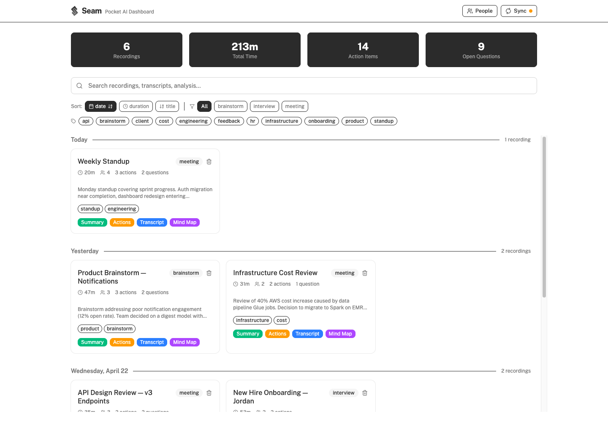
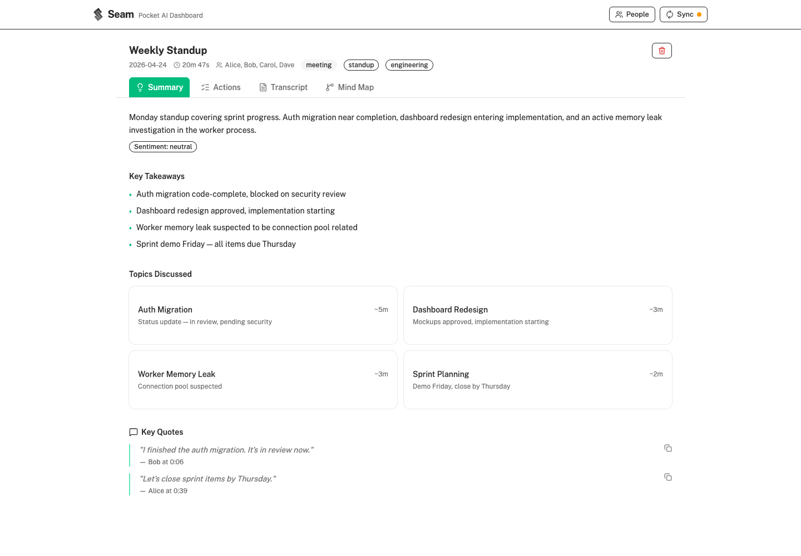
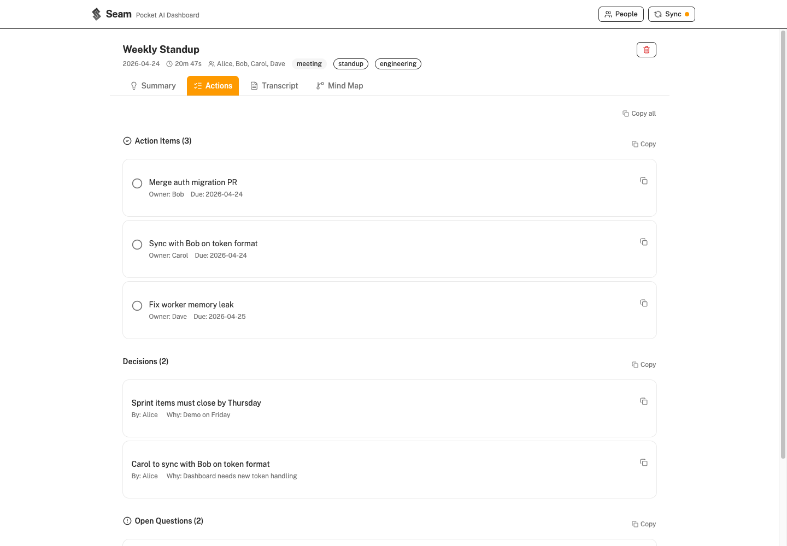
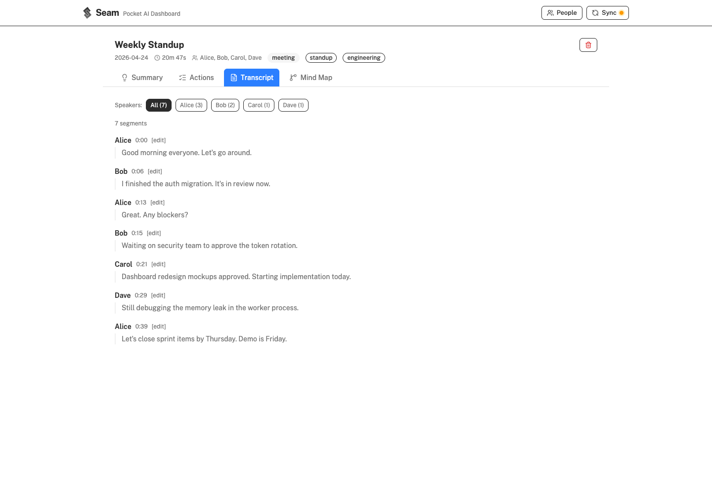
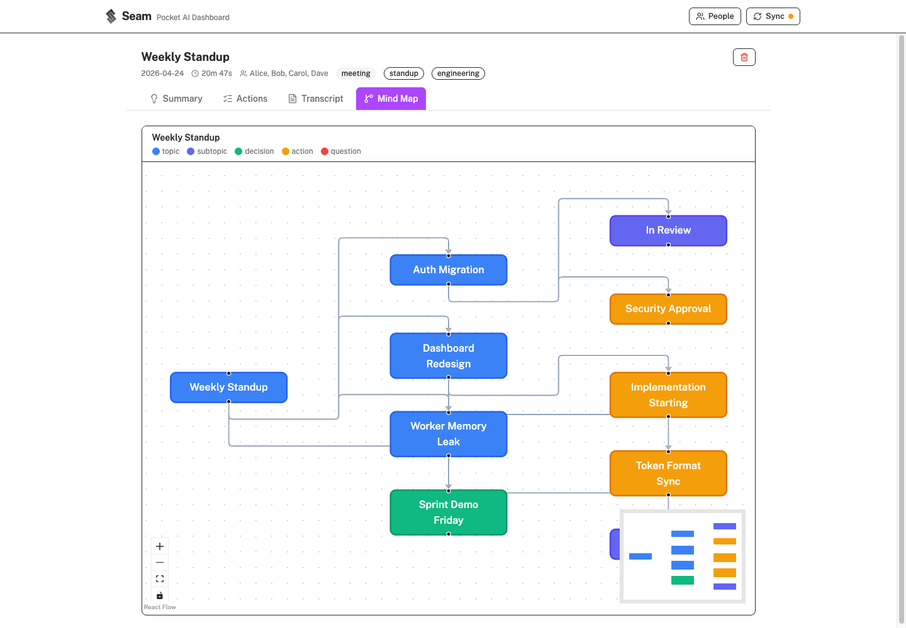

<p align="center">
  
</p>

<h1 align="center">Seam</h1>

<p align="center">
  Open-source companion for <a href="https://heypocketai.com">Pocket AI</a>.<br/>
  Pull your recordings via the API, analyze them with Claude, and browse everything in a local dashboard — no Pro subscription needed.
</p>

## Screenshots

| Home | Summary | Actions |
|------|---------|---------|
|  |  |  |

| Transcript | Mind Map |
|------------|----------|
|  |  |

## What it does

1. **Pulls** recordings from the Pocket API (transcripts, summaries, action items, mind maps)
2. **Analyzes** each recording with Claude — deeper, more structured analysis than Pocket Pro's built-in AI (summaries, action items, decisions, open questions, key quotes, mind maps, speaker inference)
3. **Displays** everything in a local dashboard with search, filtering, interactive mind map graphs, people management, and sync history

## Prerequisites

- **Node.js** 20+
- **Python** 3.10+
- **Claude Code** CLI (for analysis step) — [install](https://docs.anthropic.com/en/docs/claude-code)
- **Pocket API key** — get from the Pocket app (Settings → API)

## Quick start

```bash
git clone https://github.com/yoaquim/seam.git
cd seam
npm install

# Add your Pocket API key
cp .env.example .env
# Edit .env → POCKET_API_KEY=pk_your_key_here

# Pull recordings from Pocket + analyze with Claude
./scripts/pocket-run.sh

# Start the dashboard (API server + frontend)
npm run dev
# Open http://localhost:5173
```

## How it works

### Sync (`scripts/pocket-run.sh`)

1. **Pull** — `pocket_pull.py` calls the Pocket API, fetches new recordings (transcripts + summaries), writes to `data/recordings/`
2. **Analyze** — Scans all recordings missing analysis. For each, invokes `claude -p` with the analysis prompt + known people list. Claude writes structured JSON + markdown to `data/analysis/`
3. **Manifest** — Rebuilds `public/manifest.json` for the dashboard

### Analysis prompt (`prompts/analyze.md`)

Claude produces per recording:
- Executive summary, key takeaways, decisions, action items
- Open questions, key quotes, topic breakdown
- Mind map graph (nodes + edges)
- Speaker inference map (attributes "Unknown" transcript segments to known people)

### Dashboard

React + TypeScript + Tailwind + shadcn/ui + React Flow.

- **Home** — Recording grid with sort/filter by date, duration, type, tags. Grouped by date.
- **Detail page** — 4 tabs: Summary, Actions (toggleable, copyable), Transcript (speaker filter + manual assignment), Mind Map
- **People** — Manage known people for speaker inference
- **Sync** — Real-time logs, sync history with expandable log viewer

### People & speaker inference

Add people at `/people` with name, role, and notes. During analysis, Claude uses this list to infer who is speaking in transcripts where Pocket didn't label speakers. You can also manually assign speakers in the transcript view.

## Project structure

```
seam/
├── scripts/
│   ├── pocket_pull.py        # Pulls recordings from Pocket API
│   ├── pocket-run.sh         # Orchestration: pull → analyze → rebuild
│   └── build-manifest.py     # Aggregates data for the dashboard
├── prompts/
│   └── analyze.md            # Claude analysis prompt template
├── server/
│   └── index.ts              # Express API (sync, people, actions, speakers)
├── src/                      # React dashboard
├── .seam/                    # Local data (gitignored, created on first sync)
│   ├── recordings/           # Structured recording data
│   ├── analysis/             # Claude analysis output
│   └── people.json           # Known people registry
└── .env.example
```

## Tests

```bash
npm test          # Runs vitest (TS) + pytest (Python)
npm run test:ts   # TypeScript only
npm run test:py   # Python only
```

## Cron (optional)

```bash
# Example crontab — runs at 2am daily
0 2 * * * cd /path/to/seam && ./scripts/pocket-run.sh >> data/seam.log 2>&1
```

On macOS, launchd runs missed jobs on wake.

## License

MIT
